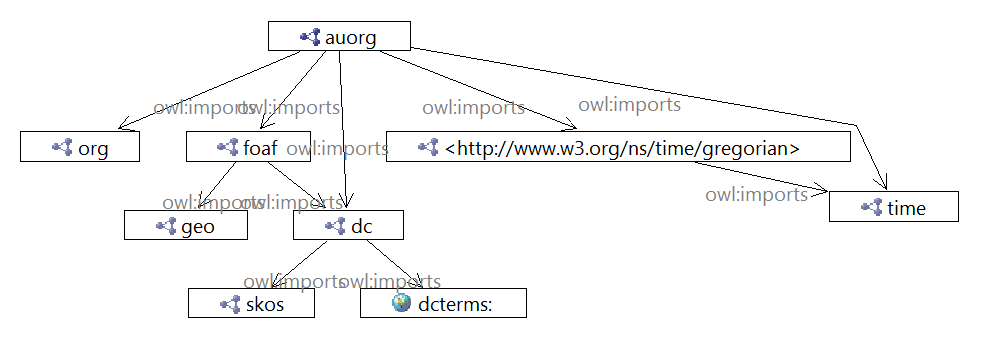

# Au Org Ontology
An OWL ontology specialising the [Organization Ontology](https://www.w3.org/TR/vocab-org/) to model Australian government entities.

The purpose of this ontology is to allow for the Semantic Web representation of Australian Government, mostly Federal Government, Entities (organisations), their subcomponents and people related to them with particular roles.

This ontology specialises the W3C's recommended Organization Ontology to model Entities. Its specialised classes and properties have been initially informed by the Australian government's online organisations directory, <https://www.directory.gov.au>. This includes particular types of organisation found in Australian Federal government such as a 'Board', 'Government Entity' and so on. While it has been designed primarily with the Commonwealth Government in mind, it is intended that it shall also apply at other levels of government.

Further specialisation and extension is likely as this ontology is developed to cover the conceptual space of systems that are important for Australian government structure, such as the Administrative Arrangement Orders that alter Entities.

This ontology is incomplete and is currently for demonstration purposes only.

## Introduction
Terminology in this ontology is sourced from:
* The [Organization Ontology](https://www.w3.org/TR/vocab-org/)
* The [directory.gov.au](https://directory.gov.au) website

## Ontology document
Namespace location:
* HTML: <http://linked.data.gov.au/def/auorg>
* RDF turtle: <http://linked.data.gov.au/def/auorg.ttl>

*Note: namespace locations will only work when the ontology is officially published via the [Australian Government Linked Data Working Group](http://linked.data.gov.au)'s PID URI assignment system.*

While under early development, HTML documentation of this ontology can be viewed at: <https://rawgit.com/CSIRO-enviro-informatics/auorg-ont/master/auorg.html>, but note that where they differ, the RDF representation is correct.

Local copies:
* HTML: [auorg.html](auorg.html)  
* RDF Turtle: [auorg.ttl](auorg.ttl)

## License
This ontology and all other content in this repository are licensed under the [Creative Commons Attribution 4.0 International (CC BY 4.0)](https://creativecommons.org/licenses/by/4.0/) (local copy of deed: [LICENSE](LICENSE)).

## Contacts
Creator:  
**Nicholas Car**  
*Senior Experimental Scientist*  
CSIRO Land & Water, Brisbane, Australia    
<nicholas.car@csiro.au>  
<http://orcid.org/0000-0002-8742-7730>  

Creator:  
**Simon Cox**  
*Research Scientist*  
CSIRO Land & Water, Melbourne, Australia    
<simon.cox@csiro.au>  
<http://orcid.org/0000-0002-3884-3420>  
